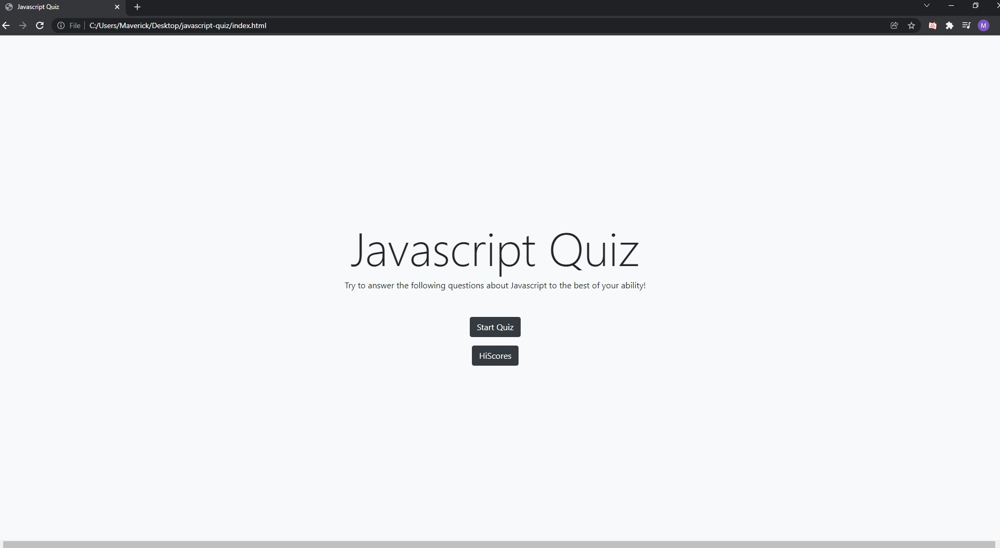
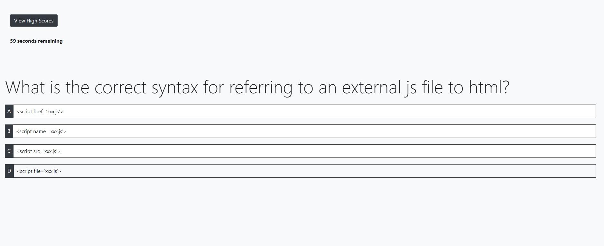
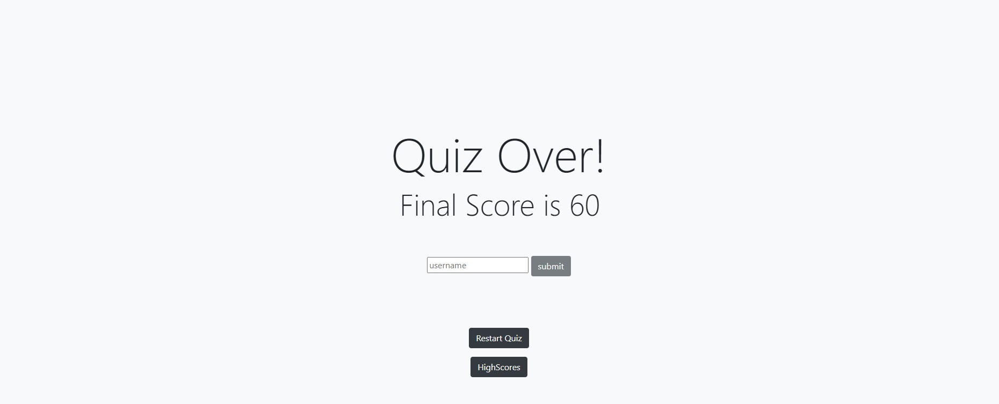

# Javascript-quiz

This application is a javascript quiz using a mixture of html,css,bootstrap, and javascript.

The following is a photo of what the index.html looks like when opened up. It has a start quiz that starts the test and a hiscores button which shows your previous scores.

once you start the quiz a timer in the top left will start counting down and will subtract 10 seconds on a wrong answer. On the top left you will also see a button to access the highscores are your convience. 
As you progress through the questions a new question will populate the quiz.html page, each time you go through the quiz the questions will be in a different order using a javascript array. 

When the timer hits 0 or you have answered all of the questions you will be taken to the end screen were it will display your final score and you can submit your name to the highscores.

